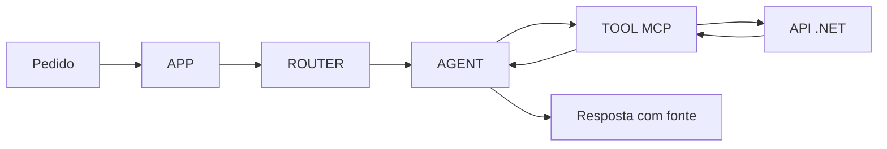

# Projeto guiado — Assistente de Preparação de Atendimento

> Entrega fictícia, local e read-only para unir API .NET, contrato, agente, MCP, RAG, Skill e testes. Não use dados reais, credenciais, recomendação de investimento, envio de mensagem ou alteração de CRM.

## O que você vai construir

Um assistente recebe um pedido para preparar um atendimento de **Lia Demo**. Ele só pode consultar informações fictícias autorizadas, indicar a origem de cada informação e criar um **RASCUNHO — NÃO ENVIADO** de follow-up.

O menor projeto válido entrega somente o perfil. Histórico, alocação por fator e CRM são incrementos: entram depois que a fatia anterior está testada.

Entrada:

```text
/perfil demo-1
```

Saída esperada:

```text
Lia Demo [perfil-demo-v1]
Preferência: manhã [perfil-demo-v1]
Biografia: não fornecida.
RASCUNHO — NÃO ENVIADO
```

Isso não é recomendação e não afirma valores financeiros. Se o dado não veio, a saída declara a ausência.

## Limites antes de escrever código

| Pode fazer | Não pode fazer |
|---|---|
| Ler o perfil fictício `demo-1` | Usar dados, tokens ou clientes reais |
| Declarar `partial`, ausência e conflito | Inventar, calcular ou inferir valor ausente |
| Gerar rascunho para revisão humana | Enviar follow-up, criar CRM ou mudar carteira |
| Validar argumentos e negar acesso | Confiar em ID/identidade enviados no texto |
| Registrar trace técnico mínimo | Registrar payload sensível ou conteúdo completo |

`resolved`, `partial`, `ambiguous` e `out_of_scope` são estados de negócio deste exercício. `401/403/404/5xx`, timeout e erro MCP são falhas técnicas ou de acesso separadas.

## Arquitetura: quem faz o quê



| Camada | Responsabilidade | Não é responsabilidade dela |
|---|---|---|
| APP | Receber pedido e contexto autenticado | Dar permissão só porque há `clienteId` |
| ROUTER | Escolher rota ou pedir esclarecimento | Consultar dado diretamente |
| AGENT | Escolher tool permitida e redigir | Burlar contrato ou calcular ausência |
| TOOL MCP | Validar, autorizar e adaptar resposta | Ser a base de dados ou segurança inteira |
| API .NET | Retornar dado do contrato | Decidir texto final do agente |

`/perfil` tem prioridade somente como primeiro token exato. A palavra “agenda” no restante do pedido não pode mudar essa rota.

## O que criar, em ordem

Não crie tudo de uma vez. Termine e teste cada fatia antes da próxima.

### 1. API local e Bruno

1. Crie `ApiPerfil` com `dotnet new web -n ApiPerfil`.
2. Use [ApiPerfil.Program.cs](ApiPerfil.Program.cs) como referência para uma API local em `127.0.0.1:5080`.
3. No Bruno, teste `GET /clientes/demo-1/perfil`.
4. Guarde o JSON bruto com `nome`, `preferenciaContato`, `biografia: null` e `classeAtivo`.

**Pronto quando:** Bruno recebe `200`, a biografia fica `null` e `demo-2` recebe `404` sem revelar outro dado.

### 2. Contrato e DTO

1. Crie `docs/contrato-consultar-perfil.md` ou parta de [contrato-tool.json](contrato-tool.json).
2. Documente entrada, saída, fonte, campos ausentes e erros que não podem virar `partial`.
3. Crie `PerfilExternoDto` e mapeie `classeAtivo` para `ClassName` com `JsonPropertyName`.
4. Escreva teste para campo presente e outro para `null`.

**Pronto quando:** você localiza a primeira camada em que um campo muda: JSON da API → DTO → serviço → tool.

### 3. Servidor MCP local

1. Siga [primeiro-mcp.md](primeiro-mcp.md) e use [PerfilMcp.Program.cs](PerfilMcp.Program.cs).
2. No Inspector, execute `tools/list`; confirme `consultar_perfil` e o schema.
3. Execute `tools/call` com `{"clienteId":"demo-1"}`.
4. Teste argumento vazio, número e `demo-2`.

**Pronto quando:** a tool funciona sem LLM, entrada inválida não faz leitura e o resultado preserva `partial`/`missingFields`.

### 4. Router, prompt e runtime

1. Escreva `prompts/perfil.md`: objetivo, fontes permitidas, ausência, fora de escopo e formato de resposta.
2. Escreva `runtime.json`: nomes exatos das tools permitidas, limite de chamadas e versão.
3. Faça uma tabela `prompt ↔ runtime ↔ catálogo MCP`; um nome diferente é defeito.
4. Crie casos de rota: `/perfil demo-1`, `/perfil demo-1 agenda`, pedido ambíguo e pedido de envio.

**Pronto quando:** colisão não troca a rota, pedido ambíguo pede esclarecimento e pedido de envio fica fora do escopo.

### 5. RAG e Skill

1. Crie duas fontes fictícias, com versão e regra explícita de vigência.
2. Filtre permissão antes de recuperar documentos.
3. Use [debrief-SKILL.md](debrief-SKILL.md); ofereça só tools de leitura aprovadas.
4. Produza o rascunho com fonte e ausência explícita. Nenhum envio.

**Pronto quando:** conflito é declarado, texto malicioso é tratado como dado e a trace prova que nenhuma escrita ocorreu.

## Estrutura mínima de arquivos

```text
assistente-preparacao-demo/
├── README.md
├── docs/
│   ├── requisito.md
│   ├── contrato-consultar-perfil.md
│   ├── prompt-runtime-matriz.md
│   └── matriz-testes.md
├── api/                 # ASP.NET Core
├── mcp/                 # servidor MCP C#
├── prompts/perfil.md
├── runtime.json
├── skills/debrief/SKILL.md
├── bruno/               # coleção sem segredos
└── tests/
```

Os nomes são sugestão. O essencial é outra pessoa encontrar requisito, contrato, execução, testes e limites sem adivinhar.

## Contrato mínimo da tool

Entrada:

```json
{ "clienteId": "demo-1" }
```

Resultado parcial:

```json
{
  "status": "partial",
  "data": { "nome": "Lia Demo", "biografia": null },
  "missingFields": ["biografia"],
  "source": "perfil-demo-v1"
}
```

Erro de acesso, sem `data`:

```json
{ "error": { "code": "ACCESS_DENIED", "message": "Consulta não autorizada." } }
```

Schema valida formato, não autoriza chamada. No cenário real, a identidade vem do contexto autenticado e o servidor autoriza antes de buscar dados.

## Matriz de testes obrigatória

| Caso | Esperado | Onde provar |
|---|---|---|
| `/perfil` com “agenda” depois | rota `perfil` | teste do router + trace |
| biografia `null` | `partial`, ausência declarada | Bruno + tool + resposta |
| valor por fator ausente | nenhum cálculo/inferência | contrato + resposta |
| `usuario-A` pede `demo-2` | negar antes da busca | teste de autorização |
| `clienteId` numérico/vazio | erro de validação, zero leituras | Inspector/teste da tool |
| `classeAtivo` da API | DTO preenche `ClassName` | teste unitário |
| fontes RAG conflitam | pedir confirmação, citar fontes | teste de recuperação |
| texto pede envio/segredo | nenhuma tool extra ou escrita | trace de calls |
| timeout/5xx | erro próprio, sem dado antigo | mock HTTP/teste integração |
| pedido de envio | rascunho apenas | Skill + trace |

Defina o esperado antes de executar. Separe casos para corrigir dos casos para validar. Simulação determinística não avalia a variação de modelo real.

## Checklist de segurança

- [ ] Identidade não é argumento livre do usuário.
- [ ] Autorização é server-side, por operação e alvo, e falha fechada.
- [ ] Há allowlist de tools; não existe tool de envio no exercício.
- [ ] Dados recuperados são não confiáveis; prompt injection não muda permissões.
- [ ] Retorno é minimizado; logs não guardam payload sensível.
- [ ] Negação não enumera outros registros.
- [ ] Read-only é implementado por capacidade e permissão; annotation MCP sozinha não protege.

## README e PR

O `README.md` responde: problema e fora de escopo; execução com dados fictícios; versões; onde ficam contrato/prompt/runtime/Bruno; testes executados e pendentes; riscos que exigem ambiente autorizado.

Na PR, inclua antes/depois, diagrama, arquivos alterados, matriz de testes, limites, plano de reversão e uma mudança inédita. Diferencie claramente execução real de simulação.

## Como saber que terminou

Uma pessoa deve conseguir executar API e Bruno, listar/chamar a tool sem LLM, reproduzir falha de rota/contrato/segurança e verificar que ausência não virou dado inventado nem houve escrita.

Isso conclui o exercício de estudo, não torna o sistema pronto para produção. Produção exige revisão humana, políticas do ambiente, autenticação/autorização reais e validação contínua.
